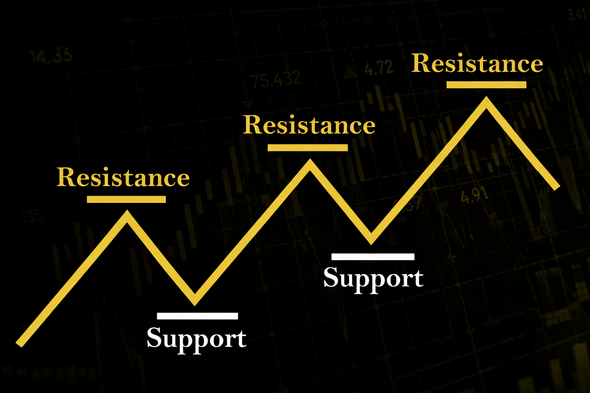

## Что на самом деле показывают уровни поддержки и сопротивления

В теории уровни поддержки и сопротивления в трейдинге часто изображают в виде аккуратных горизонтальных линий. Такой подход удобен для обучения, но в реальной торговле он упрощает картину. На самом деле это не линия, а ценовая зона, где рынок уже проявлял активность. В этих зонах цена сталкивалась с сопротивлением или находила поддержку, происходили развороты, ускорения или затяжные консолидации.

Если смотреть на уровни поддержки и сопротивления на графике цены, становится заметно, что они формируются там, где ранее сходились интересы крупных участников. Цена здесь замедлялась, делала резкие откаты или, наоборот, долго не могла пробить диапазон. Это значит, что в этих местах принимались решения, и рынок их помнит.

В техническом анализе ценность уровней заключается именно в этом наблюдаемом факте. Они строятся не на расчётах и не на производных показателях, а на реальном поведении цены. Если рынок уже реагировал на эту область, значит, она имеет значение и сейчас, пусть и в изменённом контексте. Это не прогноз и не гарантия, а рабочая рамка, внутри которой трейдер оценивает риски и возможные сценарии.

Важно понимать, что торговля от уровней поддержки и сопротивления не сводится к ожиданию автоматического разворота. Цена может пробить уровень, вернуться к нему, протестировать его с другой стороны или пройти его без заметной реакции. Задача трейдера не угадать исход заранее, а наблюдать за поведением цены в этой зоне и принимать решение на основе реакции рынка, а не самого факта касания уровня.

## Почему технические индикаторы часто запаздывают

Большинство технических индикаторов в трейдинге работают с прошлым движением цены. Скользящие средние, осцилляторы, различные производные от объёма — все они перерабатывают уже случившееся и пытаются адаптировать его к текущей ситуации.

Из-за этого возникает эффект запаздывания. Цена может подойти к сильному сопротивлению, замедлиться или начать разворачиваться, в то время как индикатор всё ещё показывает силу тренда. В результате трейдер либо входит слишком поздно, либо продолжает держать позицию там, где риск уже вырос.

Поэтому и появляется ощущение, что индикаторы не работают или работают не так, как должны. Однако они просто сглаживают движение и скрывают моменты, где рынок начинает сомневаться, а эти моменты и становятся ключевыми при торговле от уровней.

## Поведение цены важнее сигнала индикатора

Когда цена подходит к значимому уровню, рынок редко остаётся нейтральным. Он либо ускоряется, либо замедляется, либо делает резкие ложные движения. Эти реакции сложно выразить формулой, но их хорошо видно при анализе графика.

На этом и строится price action трейдинг — подход, в котором главное внимание уделяется поведению цены и структуре движения. Вместо поиска сигнала трейдер наблюдает за тем, как рынок ведёт себя в конкретной зоне.

В связке с торговлей от уровней поддержки и сопротивления это даёт более осмысленную картину рынка. Трейдер заранее знает, где возможна реакция, и готовится именно к ней, а не к абстрактному сигналу.

Торгуй как профессионал с капиталом до 100 000$.

## Почему уровни хорошо подходят для проп-трейдинга

В крипто проп-трейдинге трейдер работает в рамках жёстких правил. Есть ограничения по просадке, по размеру позиции, по количеству попыток. Здесь нет возможности действовать импульсивно или пересидеть ошибку в надежде на разворот.

Таким образом, уровни поддержки и сопротивления хорошо вписываются в формат торговли на финансируемом аккаунте. Они позволяют заранее определить точку входа, логичное место для стопа и потенциальную цель. Риск становится понятным и измеримым, а не интуитивным.

В рамках программ с финансированием для криптотрейдеров и крипто-челленджей часто выигрывают не самые агрессивные участники, а те, кто умеет ждать цену в нужной зоне и не торопится с входом. Это действительно важно при торговле крупным капиталом, где каждая ошибка имеет вес.

## Типичные ошибки при работе с уровнями

- **Превращение уровня в точку.** Одна из самых частых ошибок в техническом анализе это ожидание, что уровни поддержки и сопротивления будут отрабатываться с точностью до пункта. Рынок же реагирует диапазонами. Цена может немного не дойти до уровня, проколоть его или задержаться внутри зоны, прежде чем показать реакцию. Попытка торговать идеальное касание часто заканчивается пропущенными входами или слишком ранними стопами.
- **Игнорирование рыночного контекста.** Уровень, который хорошо работает в боковике, может легко пробиваться в сильном тренде. То, что выглядит как надёжное сопротивление на младшем таймфрейме, может быть всего лишь паузой внутри движения на старшем. Торговля от уровней поддержки и сопротивления без учёта общего контекста рынка лишает трейдера важной части информации.
- **Ожидание автоматического разворота.** Сам факт того, что цена дошла до уровня, ещё ничего не означает. Многие трейдеры входят в сделку заранее, не дожидаясь реакции рынка. В результате позиция открывается против импульса, а уровень легко пробивается. Гораздо важнее смотреть, как цена ведёт себя в зоне уровня, а не где именно проходит линия.
- **Перегруз графика уровнями.** Желание отметить каждый локальный экстремум приводит к тому, что график превращается в сетку из линий. В такой ситуации уровни поддержки и сопротивления на графике цены перестают выполнять свою функцию, а трейдер теряет фокус и начинает видеть сигналы там, где их нет. Работают не все уровни, а только те, которые действительно имеют историю реакции рынка.
- **Отсутствие подтверждения со стороны цены.** Уровень сам по себе — это лишь область повышенного внимания. Решение о входе должно приниматься по поведению цены: замедлению движения, резким откатам, изменению структуры свечей. Без этого price action трейдинг теряет смысл и торговля от уровней превращается в угадывание.
- **Непонимание роли уровня после пробоя.** После пробития уровень часто меняет свою функцию. Поддержка может стать сопротивлением и наоборот. Игнорирование этого принципа приводит к входам в сторону уже отработанного движения и лишним стопам.

Важно помнить, что уровни поддержки и сопротивления не дают гарантий и не заменяют анализ. Они лишь показывают зоны, где рынок с высокой вероятностью будет реагировать. Окончательное решение всегда принимается по реакции цены в этой области, а не по факту касания линии.

## Почему со временем график становится проще

Если посмотреть на путь большинства опытных трейдеров, можно заметить закономерность: со временем график упрощается. Индикаторы либо исчезают, либо остаются в роли вспомогательных ориентиров. На первый план выходят уровни поддержки и сопротивления и структура движения цены.

Причина проста. Цена может игнорировать сигнал индикатора, но она не проходит значимый уровень незаметно. Рынок всегда как-то реагирует, и именно эта реакция даёт трейдеру информацию.

Для тех, кто планирует торговать криптовалютой на профессиональный капитал и стремится получить финансируемый аккаунт, понимание логики уровней становится базовым навыком. Это не универсальный ответ на все вопросы, но прочная основа для осмысленной торговли.

## Итог

Уровни поддержки и сопротивления не обещают идеальных входов и не дают готовых решений. Зато они показывают главное: где рынок уже принимал решения и где он с высокой вероятностью будет делать это снова. В отличие от технических индикаторов, уровни не запаздывают и не сглаживают движение, а позволяют работать с ценой напрямую.

Это особенно важно в условиях дисциплинированной торговли, где риск ограничен правилами и нет возможности переждать ошибку. На финансируемом аккаунте выигрывает не тот, кто угадывает направление, а тот, кто понимает контекст и действует аккуратно.

Если ты хочешь применять этот подход на практике и торговать уверенно на капитал компании, Hash Hedge предлагает финансируемый аккаунт с прозрачными условиями, возможностью торговать на капитал до 100 000$ и чёткими правилами управления риском. Такой формат позволяет сосредоточиться на анализе и дисциплине, а не на страхе потери собственных средств.
