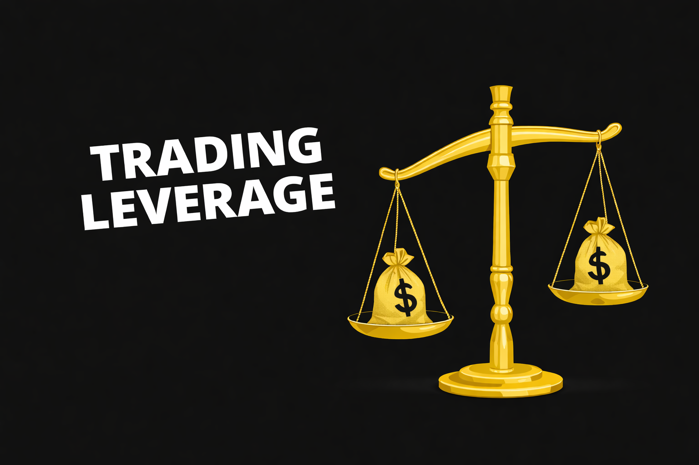

## Как работает кредитное плечо

Чтобы понять, почему кредитное плечо в трейдинге часто используется неправильно, важно разобраться в его механике. Плечо позволяет трейдеру контролировать позицию большего объёма, чем его собственный капитал. По сути, это форма маржинальной торговли, где часть средств для сделки предоставляется биржей.

Например, при использовании плеча 10× позиция на $10,000 может быть открыта при счете в $1,000 собственного капитала. Это увеличивает потенциальную прибыль при движении цены в нужную сторону, но одновременно многократно усиливает риск ликвидации.

В условиях маржинальной торговли в криптовалюте даже небольшое движение цены против позиции может привести к значительным потерям. Чем выше плечо в криптотрейдинге, тем меньше расстояние до ликвидации и тем быстрее позиция может быть закрыта биржей автоматически.

При высоком плече чувствительность позиции к колебаниям рынка резко возрастает. Даже обычная внутридневная волатильность может стать причиной принудительного закрытия сделки, поэтому риск ликвидации при плече напрямую зависит не только от направления движения цены, но и от выбранного размера позиции и плеча.

## Злоупотребление плечом

Ошибки трейдеров при использовании плеча зачастую связаны не с техническими аспектами, а с поведением и стремлением ускорить результат.

Одной из основных причин становится FOMO в трейдинге. После сильного движения трейдеры пытаются быстро войти в рынок, увеличивая позицию с помощью плеча. В такой ситуации решение принимается под влиянием импульса, а не на основе анализа.

Другой распространённый сценарий — это попытка отыграться после убытка. После серии неудачных сделок трейдер увеличивает объём позиции, чтобы быстрее вернуть потерянные средства. В сочетании с маржинальной торговлей это приводит к резкому росту риска на сделку.

Дополнительную проблему создаёт эмоциональная торговля. После прибыльных сделок трейдеры начинают переоценивать свои возможности и увеличивают размер позиции, что постепенно приводит к избыточному риску в трейдинге.

В результате размер позиции и плечо начинают расти быстрее, чем качество торговых решений.

## Как плечо влияет на риск

Использование плеча напрямую связано с управлением капиталом. Чем выше плечо, тем сильнее любое движение цены влияет на результат сделки.

Основные последствия использования высокого плеча в трейдинге:

- Небольшая рыночная волатильность может привести к увеличению просадки в трейдинге, особенно если позиция открыта большим объёмом.
- Чем выше плечо в криптотрейдинге, тем меньше расстояние до ликвидации и тем выше риск ликвидации при плече.
- Высокая нагрузка на депозит увеличивает общий риск в трейдинге и делает результаты менее стабильными.
- Увеличение размера позиции и плеча повышает чувствительность сделки к даже небольшим колебаниям цены.

При высоком уровне плеча диапазон допустимого движения цены становится минимальным. В таких условиях даже обычная рыночная волатильность может привести к принудительному закрытию позиции.

Таким образом, профессиональные трейдеры рассматривают кредитное плечо в трейдинге не как способ увеличить прибыль, а как инструмент более точного управления риском.

## Безопасное использование плеча

Безопасное использование плеча начинается с контроля размера позиции. Даже при использовании маржинальной торговли в криптовалюте ключевым фактором остаётся риск на сделку.

Профессиональные трейдеры обычно ограничивают риск небольшой долей капитала, независимо от уровня плеча. Такой подход помогает сохранять защиту капитала в трейдинге даже в условиях высокой волатильности.

Также важно учитывать структуру рынка и уровень ликвидности. В периоды новостей или резких движений плечо в криптовалюте значительно увеличивает вероятность ликвидации.

Поэтому ключевой принцип безопасной торговли заключается в том, чтобы использовать плечо в криптотрейдинге как инструмент гибкости, а не как способ увеличить размер ставки.

## Значение для проп-трейдинга

В условиях проп-трейдинга криптовалют неправильное использование плеча особенно опасно. Повышенный риск ликвидации и чрезмерный размер позиции могут привести к быстрому нарушению лимитов по просадке.

Участники трейдинг-челленджа в Hash Hedge должны соблюдать строгие правила управления риском. Поэтому ключевым навыком становится не агрессивное использование плеча, а контроль размера позиции и защита капитала.

Трейдеры, которые грамотно используют плечо в трейдинге, чаще проходят оценку и получают финансируемый аккаунт для трейдинга.

При торговле на капитал компании основной задачей становится стабильность результатов и сохранение счёта, а не максимальная прибыль в одной сделке.

Торгуй дисциплинированно на капитале до $100 000.

## Итоги

Кредитное плечо в трейдинге само по себе не является проблемой. Это инструмент, который может как усилить стратегию, так и разрушить её при неправильном использовании.

Основные проблемы возникают из-за эмоциональной торговли, FOMO в трейдинге и попыток ускорить результат за счёт увеличения позиции. В таких условиях плечо в криптотрейдинге начинает работать против трейдера.

Системный подход, контроль риска на сделку и грамотное управление риском позволяют использовать плечо более безопасно и сохранять стабильность результатов.

Если твоя цель — пройти трейдинг-челлендж в Hash Hedge и работать с капиталом до $100,000, ключевыми навыками становятся дисциплина, контроль риска и разумное использование кредитного плеча.
