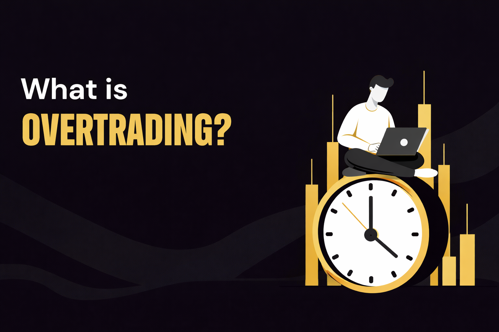

## Что такое переторговка в трейдинге

Переторговка — это ситуация, когда трейдер открывает сделки не потому, что есть обоснованный сетап, а потому что чувствует необходимость быть в рынке. Это может проявляться по-разному: частые входы без чёткого плана, попытки добрать движение, открытие сделок после уже завершившегося импульса.

В криптотрейдинге проблема усиливается из-за высокой волатильности и постоянного потока сигналов. Рынок почти всегда что-то делает, и это создаёт иллюзию, что возможность упущена, если не войти прямо сейчас. В результате переторговка в криптотрейдинге становится привычной моделью поведения, которое может привести к разрушительным результатам.

## Почему трейдеры переторговывают

Когда возникает вопрос, почему трейдеры переторговывают, ответ редко лежит на поверхности. В большинстве случаев это не одна ошибка, а сочетание нескольких факторов, которые постепенно подталкивают трейдера к избыточной активности.

Во-первых, ключевую роль играет информационная перегрузка трейдера. Современная торговая среда буквально насыщена сигналами: несколько таймфреймов, индикаторы, уровни, новости, комментарии и чужие мнения. Трейдер перестаёт фильтровать информацию и начинает реагировать не на структуру рынка, а на сам поток данных. Это снижает качество решений и увеличивает количество сделок без реального преимущества.

Во-вторых, существенное влияние оказывает психология трейдинга. Страх упустить движение (FOMO), желание быстро вернуть день после убыточной сделки, раздражение после стоп-лосса — всё это усиливает импульсивность. В такие моменты торговля перестаёт опираться на заранее определённый план. Решения принимаются ситуативно, под влиянием текущего движения цены, а серия отдельных входов превращается в цепочку реакций.

В-третьих, переторговка почти всегда связана с отсутствием чётких ограничений. Когда нет заранее установленного лимита на количество сделок, нет сценария, при котором торговля останавливается, и не определены стоп-условия, активность начинает расти сама по себе. Трейдер воспринимает увеличение числа входов как поиск возможностей, хотя это часто приводит к снижению дисциплины и росту ошибок.

## Роль риск-менеджмента в переторговке

Важно понимать: переторговка редко возникает сама по себе, являясь прямым следствием слабого или формального подхода к управлению риском. Если в торговле нет чётко выстроенного риск-менеджмента, отсутствие ограничений неизбежно приводит к росту количества сделок.

Когда риск на одну сделку кажется незначительным, трейдер психологически разрешает себе входить чаще. Каждая отдельная позиция выглядит безопасной, не требующей строгого отбора. В результате контроль над частотой входов ослабевает, а торговля постепенно смещается от выборочной к непрерывной.

Проблема усугубляется тем, что серия мелких решений редко воспринимается как риск. Однако именно они накапливаются быстрее всего. Несколько неидеальных входов подряд, открытых без полноценного сценария, формируют цепочку небольших убытков. Вместе они приводят к ощутимой просадке, которая кажется неожиданной, хотя на самом деле была заложена структурно.

Отсутствие дневных лимитов, ограничений по количеству сделок или условий остановки торговли усиливает этот эффект. Трейдер продолжает оставаться в рынке, пытаясь доторговать результат, и тем самым ещё больше увеличивает нагрузку на депозит и психику.

Когда заранее определено, сколько сделок допустимо, какой объём риска приемлем и в каких условиях торговля прекращается, пространство для переторговки существенно сужается. Риск-менеджмент в этом смысле работает как фильтр: он не даёт активности выйти за пределы системы, даже если рынок провоцирует на постоянные входы.

## Типичные ошибки, которые приводят к переторговке

Переторговка возникает, когда трейдеры делают следующее:

- Торговля без чёткого плана и сценария.
- Импульсивные сделки после пропущенного движения.
- Попытки компенсировать убыток следующей сделкой.
- Отсутствие лимита на количество сделок в день.
- Игнорирование состояния рынка и контекста.

Все эти ошибки объединяет одно — потеря контроля. Трейдер реагирует на рынок, вместо того чтобы работать по системе.

## Как перестать переторговывать

Ответ на вопрос как перестать переторговывать не свести к одному приёму. Речь идёт о перестройке подхода в целом.

1. **Чёткие ограничения.** Ограничение по числу сделок, по дневному риску и по времени торговли автоматически снижает импульсивность.
2. **Фокус на качестве, а не количестве.** Торговля должна начинаться с мысли, почему эта сделка оправдана, а не почему бы не войти.
3. **Осознание роли контекста.** Не каждое движение требует участия. Умение не торговать — это один из ключевых навыков системного трейдера.

## Почему проп-трейдинг снижает шанс переторговки

В проп-трейдинге в крипте проблема переторговки проявляется довольно наглядно. Правила проп-трейдинга, а именно лимиты по просадке, ограничения по риску и требования к дисциплине, не позволяют компенсировать ошибки количеством сделок.

Формат финансируемого аккаунта вынуждает трейдера заранее планировать активность и фильтровать входы. Здесь нельзя пересидеть серию ошибок или торговать без системы. Так что торговля на капитал компании часто помогает трейдерам избавиться от переторговки: структура и ограничения возвращают фокус на процесс, а не на эмоции.

Торгуй без переторговки и лишнего давления с капиталом до $100 000.

## Итог

Переторговка — это не проблема стратегии и не недостаток знаний, а следствие отсутствия структуры, слабого контроля риска и эмоциональной реакции на рынок.

Трейдер, который выстраивает дисциплину в трейдинге, ограничивает активность и работает в рамках системы, постепенно избавляется от импульсивных решений.

Если цель торговать стабильнее, снизить влияние эмоций и работать в среде, где риск-менеджмент в трейдинге встроен в правила, формат проп-трейдинга с Hash Hedge станет логичным шагом. Возможность получить финансируемый аккаунт и торговать на капитал компании до $100 000 позволяет сосредоточиться на качестве решений, а не на постоянной гонке за входами.
