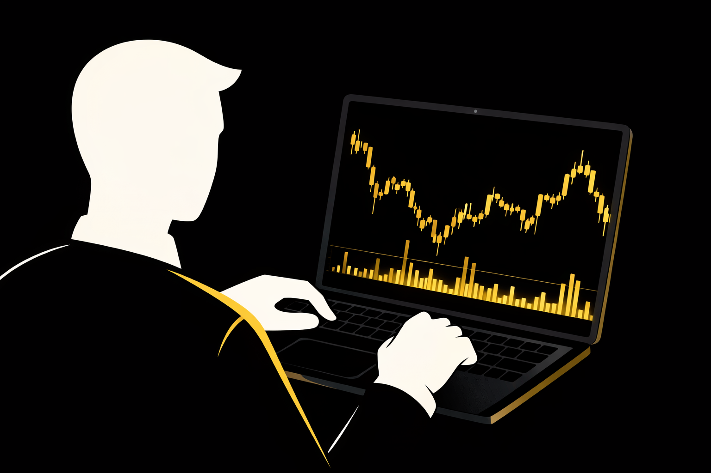

## Рынок меняется быстрее стратегии

Любая стратегия рассчитана на определённый тип движения: тренд, диапазон, высокую или низкую волатильность. Пока структура рынка соответствует этим условиям, результаты выглядят стабильными.

Но фазы рынка криптовалют меняются. После сильного тренда может начаться длительная консолидация. Периоды высокой активности сменяются снижением объёмов. Волатильность и стратегия оказываются тесно связаны: подход, рассчитанный на импульсный рынок, начинает давать ложные сигналы в боковике.

Это становится сильно заметно в условиях смены бычьего и медвежьего рынка. Стратегии, ориентированные на покупки откатов, перестают работать при устойчивом снижении. Трендовые системы, наоборот, начинают терять эффективность в периодах неопределённости.

Таким образом, вопрос, почему стратегии перестают работать, связан прежде всего с изменением рыночной среды.

## Переоптимизация стратегии как скрытая проблема

Когда результаты ухудшаются, многие пытаются донастроить систему: добавляют фильтры, меняют параметры, уточняют условия входа. Иногда это даёт временное улучшение, но может возникнуть эффект переоптимизации стратегии. Подход начинает идеально описывать прошлые движения, но теряет устойчивость к новым условиям. Тестирование торговой стратегии должно проверять не точность отдельных входов, а её способность работать в разных фазах рынка.

Иногда сама система остаётся рабочей, но меняется поведение трейдера. После серии убытков появляется желание ускорить восстановление: увеличивается объём позиции, снижается качество входов, открываются сделки вне плана.

В результате нарушается последовательность, а вместе с ней исчезает стабильность. Каждое решение начинает зависеть от предыдущего результата, а не от правил.

Так возникает ощущение, что торговая стратегия перестала работать, хотя на самом деле меняется уровень торговой дисциплины.

## Почему устойчивость важнее точности

Даже сильная стратегия проходит периоды снижения эффективности. Ни один подход не работает одинаково в любых условиях: меняется волатильность, структура движения, поведение участников. В такие моменты проблема заключается не в точности сигналов, а в способности трейдера сохранить последовательность действий.

Ключевым фактором становится устойчивость стратегии в трейдинге. Она определяется тем, насколько трейдер способен:

- Соблюдать правила независимо от результата предыдущих сделок.
- Ограничивать риск в трейдинге, не увеличивая нагрузку на депозит после убытков.
- Контролировать размер позиции в зависимости от текущих условий рынка.
- Переживать временные просадки без попыток изменить систему на эмоциях.

Важно понимать, что большинство стратегий теряет эффективность временно, а не окончательно. Попытки изменить правила в момент снижения результатов часто только усиливают нестабильность и нарушают статистику.

Контроль риска в трейдинге позволяет пережить периоды, когда рынок не соответствует ожиданиям. Если нагрузка на капитал остаётся ограниченной, стратегия получает время на восстановление, а результат на дистанции остаётся управляемым. Устойчивость в этом смысле означает не отсутствие просадок, а способность проходить через них без разрушения торгового процесса.

Адаптируй стратегию и торгуй с контролем риска на капитале до $100 000.

## Адаптация вместо постоянного поиска

Когда стратегия перестаёт давать результат, естественная реакция — искать новую. Однако постоянная смена подходов редко решает проблему и приводит к потере последовательности.

Гораздо важнее понимать, как адаптировать торговую стратегию к рынку. Речь идёт не о пересмотре правил после каждой серии убытков, а о работе с текущим контекстом. В условиях роста волатильности трейдеру важно учитывать изменение амплитуды движения и корректировать ожидания по сделкам. В периоды неопределённости разумнее снижать торговую активность и избегать входов без явного преимущества. Если рыночные условия ухудшаются, логичным шагом становится уменьшение размера позиции, чтобы сохранить контроль над риском.

При этом ключевым остаётся регулярный анализ эффективности стратегии, но не по результату отдельных сделок, а по стабильности её работы на дистанции. Такой подход позволяет сохранить основу системы и одновременно учитывать изменение рыночных условий, не разрушая процесс из-за краткосрочных колебаний результатов.

## Роль риск-менеджмента в долгосрочной стабильности

В долгосрочной перспективе результат определяется не точностью отдельных входов, а качеством риск-менеджмента в криптотрейдинге. Даже самая сильная стратегия неизбежно проходит периоды снижения эффективности, и именно управление риском решает, сможет ли трейдер сохранить капитал до момента, когда условия снова станут благоприятными.

Если риск на сделку остаётся стабильным, даже серия убыточных периодов не приводит к критическим потерям. Контроль управления размером позиции, ограничение максимальной просадки и снижение нагрузки на депозит в условиях повышенной волатильности позволяют удерживать общий риск на приемлемом уровне. В таких условиях убытки остаются частью рабочего процесса, а не превращаются в фактор, способный вывести трейдера из рынка.

Важно и то, что предсказуемый уровень риска снижает давление на принятие решений. Когда возможные потери заранее ограничены, трейдеру легче соблюдать правила и сохранять последовательность, не пытаясь компенсировать убытки за счёт увеличения объёма или частоты сделок.

По сути, стабильный трейдинг — это способность пережить неблагоприятную фазу рынка без разрушения системы. Когда риск контролируется, стратегия получает время адаптироваться к изменению рыночных условий, а результат на дистанции становится более устойчивым и управляемым.

## Почему стабильность в проп-трейдинге важна

В условиях проп трейдинга криптовалют требования к стабильности становятся жёстче. Торговля на финансируемом аккаунте проходит в рамках строгих ограничений по просадке и риску.

В программах финансирования трейдеров и крипто трейдинговых челленджах успехов добиваются те, кто умеет сохранять последовательность и адаптироваться к рынку.

При торговле криптовалютой на профессиональный капитал основная задача заключается как раз в устойчивых результатах на дистанции.

## Итог

Большинство стратегий теряют эффективность не потому, что изначально были плохими. Причина в том, что рынок меняется, а подход остаётся прежним. Рыночные циклы, изменение волатильности и структуры движения требуют гибкости и контроля риска.

Долгосрочные результаты строятся вокруг трёх факторов: адаптации торговой стратегии, дисциплины и стабильного контроля риска в трейдинге. В таких условиях даже периоды просадки становятся частью процесса, а не поводом для постоянной смены системы.

Если ты хочешь работать в среде, где устойчивость и дисциплина имеют приоритет, Hash Hedge предлагает финансируемый аккаунт с прозрачными правилами и возможностью торговать с капиталом до $100 000. Такой формат помогает сосредоточиться на стабильности — на том, что действительно определяет результат на дистанции.
